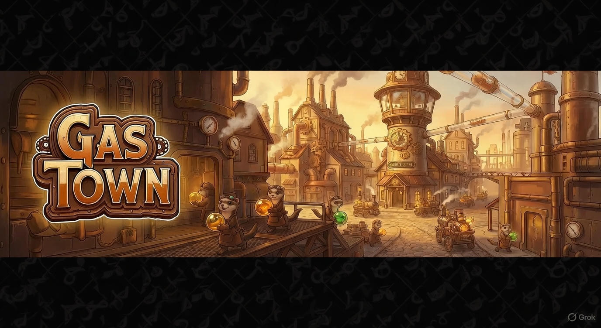

# GastownUI

A voice-first, cross-platform dashboard for [Gas Town](https://github.com/mbarnson/gastown) - the autonomous agent orchestration system.



## What is Gas Town?

Gas Town is a multi-agent workspace manager where AI agents (called "polecats") work autonomously on software tasks. GastownUI provides visibility into this chaos - real-time dashboards, voice control, and tmux integration to watch agents think.

**The twist?** Gas Town agents built this UI themselves. The polecats writing code are visible in the dashboard they're building. It's recursive, slightly absurd, and it works.

## Quick Start

```bash
# Clone and install
git clone https://github.com/mbarnson/GastownUI.git
cd GastownUI
npm install

# Run in browser (no native features)
npm run dev
# Open http://localhost:3000

# Run full desktop app with voice
npm run tauri:dev
```

See [docs/LAUNCH.md](docs/LAUNCH.md) for platform-specific instructions and build options.

## Features

### Voice-First Interface

Local LLM-powered voice assistant (LFM2.5-Audio). No cloud APIs - everything runs on your machine.

- Push-to-talk or always-listening mode
- Natural language queries about convoy status, blockers, and work
- Personality included (helpful with a dash of snark)

### Real-Time Dashboard

- **Convoy Progress** - Track batch work across multiple agents
- **Activity Feed** - Live stream of merges, claims, and completions
- **Cost Tracker** - Monitor API token usage
- **Health Status** - Quick overview of agent and rig state

### Tmux Integration

Gas Town runs on tmux. GastownUI doesn't hide that - click to attach to any agent session and watch them work in real-time.

### Accessibility

WCAG 2.1 AA compliant with VoiceOver, screen reader support, reduce motion, color blind modes, and keyboard navigation.

## Gas Town Terminology

| Term | Description |
|------|-------------|
| **Rig** | Project container with its own beads (issues), polecats, and merge queue |
| **Polecat** | Worker agent with dedicated git worktree |
| **Witness** | Per-rig manager monitoring polecat health |
| **Refinery** | Merge queue processor |
| **Mayor** | Global coordinator dispatching work across rigs |
| **Beads** | Issue tracking system |
| **Convoy** | Batch of related tasks executed together |

## Tech Stack

| Layer | Technology |
|-------|------------|
| Frontend | TanStack Start + Router + Query |
| Native Shell | Tauri 2.0 |
| Voice | LFM2.5-Audio via llama.cpp |
| Backend | Rust |

### Platform Support

- macOS, Windows, Linux (desktop)
- iOS, Android (companion apps)
- Web (limited features)

## Documentation

- [Getting Started](docs/LAUNCH.md) - Installation and running
- [First-Time Setup](docs/FTUE.md) - Voice-guided onboarding
- [Product Requirements](docs/PRD.md) - Full feature specification
- [Windows Setup](docs/WINDOWS_INSTALL.md) - Windows-specific instructions
- [iOS Release](docs/ios-release.md) - App Store deployment

## Contributing

```bash
# See available work
bd ready

# Claim a task
bd update <id> --status=in_progress

# Submit when done
gt done
```

Or open an issue - the Mayor reads everything.

## License

MIT

---

*Built by Gas Town, for Gas Town.*
